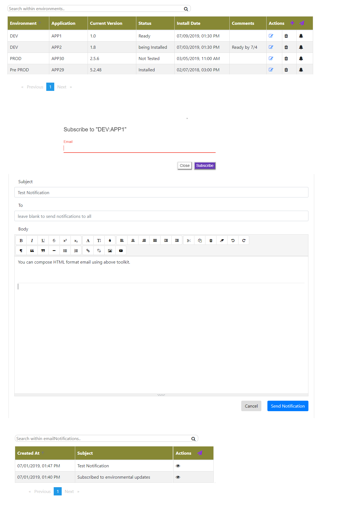

The `server` app leverages node js and uses MongoDB for data storage.
The `client` app leverages ng and GET/POST to server app.


###### To build the Project:
`( cd server && npm install )`
`( cd client && npm install && npm run build )`

###### To run the project locally: [refer to package.json file]
`( cd server && npm run startp )` 
`( cd client && npm run startp )`

_Note_: You can use `Dockerfile` to build docker images. It uses *docker multi-stage* build process. Please refer to `kubernetes-deployment.yaml` for Kubernetes resources. The client app is hosted on nginx and `nginx-conf` folder contains custom configurations.

###### Run the following from MongoDB shell:
```
db.notificationReceivers.insert({
    email_list: '<comma_seperated_distribution>'
});
```

###Features
* Add Environment details.
* View Environment details. (sortable)
  * edit environemt
  * delete environemt
  * subscibe to environemt updates
* Send Notifications
* View notifications (sortable)
* Search option for both environments and notifications.
* Pagination




